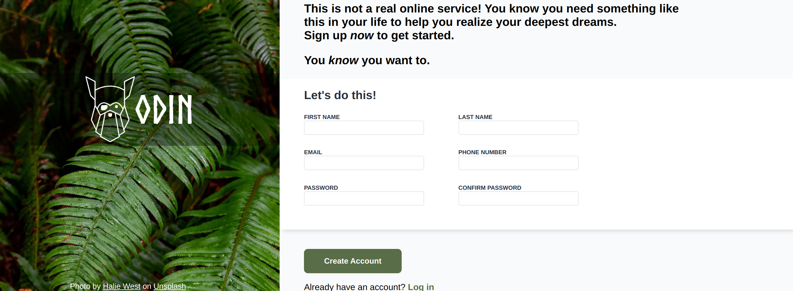

# Odin Sign-Up Form
 
This is a [project](https://www.theodinproject.com/lessons/node-path-intermediate-html-and-css-sign-up-form) from "The Odin Project".

We are wanted to create a webpage given a design.

What I've learned: 
- CSS Units 
- CSS Advanced Selectors 
- CSS Functions
- Positioniing
- HTML Forms